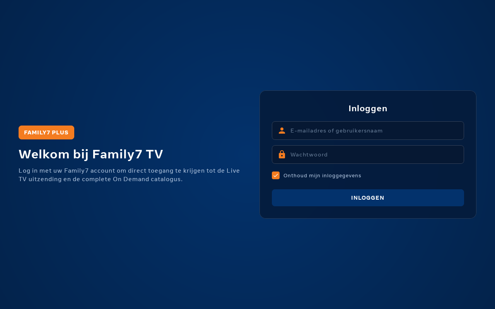
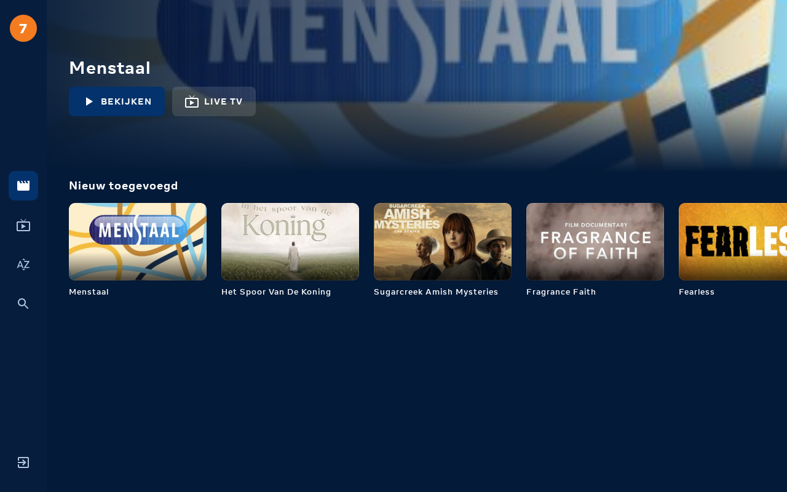
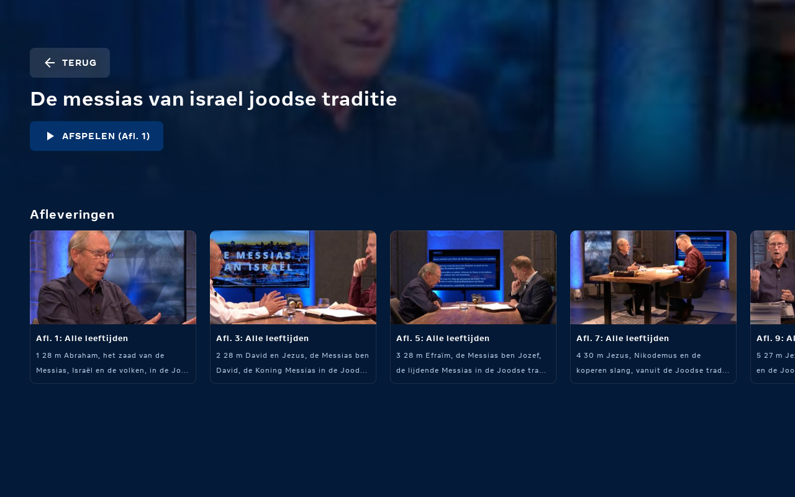
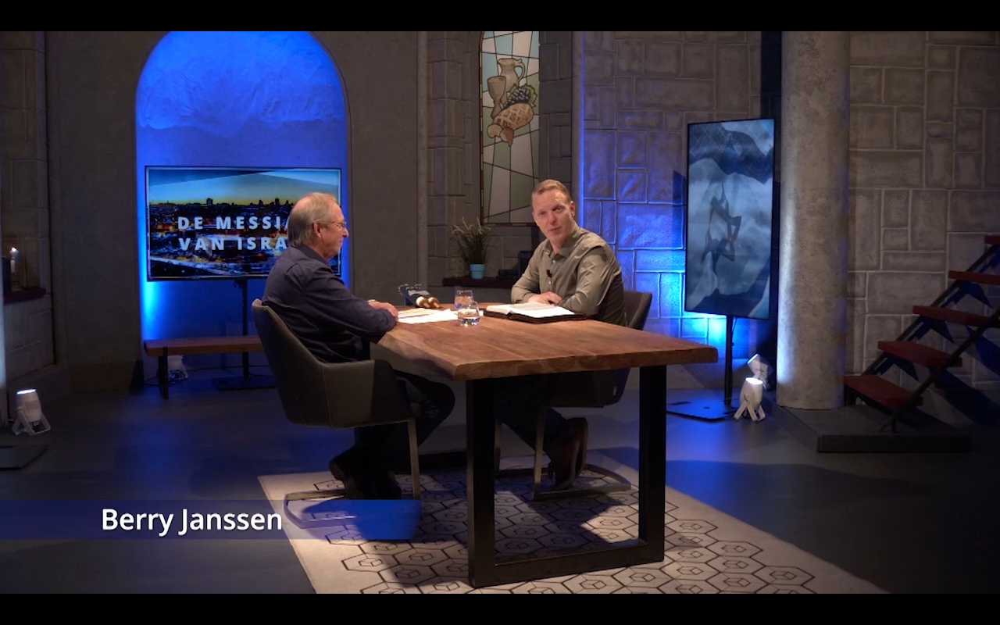
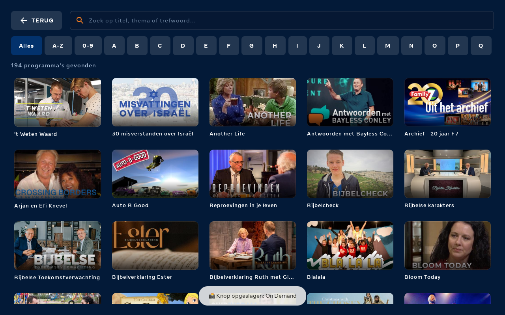

# Family7 Android TV App 📺✝️

[](https://github.com/jwhengeveld/Family7-Android-TV/actions/workflows/android-build.yml)
[](https://github.com/jwhengeveld/Family7-Android-TV/releases/latest)
[](https://kotlinlang.org)
[](https://developer.android.com/jetpack/compose/tv)
[](https://developer.android.com/media/media3)

Een moderne, native **Android TV / Google TV** applicatie voor [Family7](https://www.family7.nl/), ontwikkeld in **Kotlin** met **Jetpack Compose for TV**, **Material 3**, en **AndroidX Media3 (ExoPlayer)**.

De app biedt volledige ondersteuning voor zowel **Live TV** (Family7 Plus livestream) als de complete **On Demand** videotheek met alle programma's, seizoenen, afleveringen en zoekfunctie.

---

## 📸 Schermafbeeldingen (Screenshots)

| Inlogscherm (Drupal Auth) | On Demand Startscherm |
|---|---|
|  |  |

| Programmadetails & Afleveringen | On Demand Video Playback (HD HLS) |
|---|---|
|  |  |

| Live TV (Family7 Plus Uitzending) | A-Z Videotheek & Zoeken |
|---|---|
|  |  |

---

## ✨ Functionaliteiten

- 🔴 **Live TV Uitzending (Family7 Plus)**
  - Directe HLS-streamweergave via de Streampartner streaming backend.
  - Elektronische Programmagids (EPG) overlay met huidige en volgende programma's.
  - Automatische kwaliteitsselectie (tot 1080p Full HD) met minimale latentie.
- 🎬 **On Demand Videotheek**
  - Featured Hero Banner met uitgelichte programma's.
  - Dynamische rijen ("Aanbevolen", "Mijn lijst", "Originals", "Documentaires", "Bijbelstudie", etc.).
  - Programmadetailpagina's met synopsis, seizoenen, afleveringsoverzichten en speelduur.
- 🧒 **Kids-sectie**
  - Eigen ingang naar de Family7+ specialpagina met kinderprogramma's.
  - Het adres van die pagina wordt in het menu van Family7+ opgezocht, dus een
    hernoeming of verhuizing aan de kant van Family7 gaat vanzelf mee.
- 🔖 **Mijn lijst (dezelfde lijst als op de site)**
  - Gekoppeld aan Family7 zelf: de app leest /plus/mijnlijst en gebruikt hetzelfde
    eindpunt als de knop op de website, dus wat u hier bewaart staat ook op
    family7.nl en op uw andere apparaten.
  - Verschijnt als eerste rij op het startscherm en als eigen overzicht in de zijbalk.
- 🔍 **A-Z Catalogus & Zoeken**
  - Snel alfabetisch filteren op alle beschikbare programma's, inclusief
    vervolgpagina's, zodat nieuwe titels er automatisch bij komen.
  - Real-time zoekfunctie op titel en thema.
- 📡 **Volledig dynamisch, niets vastgezet in de code**
  - Rijen, programma's, afleveringen en specials komen rechtstreeks van
    family7.nl; er staat geen catalogus in de app.
  - De live speler-URL wordt van de livepagina zelf gelezen. De laatst werkende
    speler- en stream-URL worden onthouden als noodgreep, in plaats van een
    vaste URL die veroudert zodra Streampartner van host wisselt.
- 🎮 **Geoptimaliseerd voor TV Afstandsbediening (D-Pad)**
  - Vloeiende focus-indicatoren met schaalvergroting (1.06x) en Family7-rode accenten uit het logo.
  - Leanback launcher compatibel voor Android TV, Google TV, en smart home portals (zoals Meta Portal Go).
- ▶️ **Standaard Android TV mediabediening**
  - De officiele Media3 `PlayerView`-bediening: een druk op OK of een tik brengt de
    bediening in beeld, OK speelt/pauzeert, links/rechts spoelt 10 s terug / 30 s vooruit,
    en na 5 seconden verdwijnt de bediening weer.
  - Een `MediaSession` registreert de weergave bij het systeem, zodat "Now playing",
    de mediabalk en de mediatoetsen van de afstandsbediening de app aansturen, met de
    juiste titel, programmanaam en omslagafbeelding.
  - Het scherm blijft aan tijdens het afspelen en de weergave pauzeert bij het
    verlaten van de voorgrond.
- 🎨 **Merkidentiteit**
  - Het Family7 logo is als schaalbare vector opgenomen (`art/family7_logo.svg` en
    `art/family7_mark.svg`, plus de VectorDrawables in `res/drawable/`) en wordt gebruikt
    voor het startscherm, het inlogscherm, de zijbalk, de speler, het app-icoon
    (adaptief, inclusief monochrome variant) en de Android TV banner.
- ⏳ **Laadschermen met plaatshouders**
  - Startscherm, programmapagina, zoeken, kids en mijn lijst tonen tijdens het
    laden de uiteindelijke indeling in plaats van een leeg vlak.
- 🔐 **Veilige Authenticatie**
  - Drupal authenticatie met sessie- en cookiebeheer.
  - Inloggegevens worden nooit hardcoded opgeslagen; optionele veilige versleutelde lokale opslag via AndroidX Security EncryptedSharedPreferences.
  - Nog geen account? Het inlogscherm toont een QR-code naar het inschrijfformulier
    van Family7 Plus (€ 3 per maand, eerste 10 dagen gratis) - handiger dan een
    webadres overtypen met de afstandsbediening.

---

## 🔑 Release bouwen

De release-build wordt ondertekend met een eigen sleutel; de gegevens staan in
`keystore.properties` in de projectmap. Dat bestand en de keystore staan in
`.gitignore` en horen niet in de repo:

```properties
storeFile=keystore/family7-release.jks
storePassword=...
keyAlias=family7
keyPassword=...
```

Ontbreekt `keystore.properties`, dan bouwt `./gradlew assembleRelease` gewoon
door, maar levert het een niet-ondertekende APK op.

### Uitbrengen via GitHub

De sleutel staat ook als repository secrets in GitHub
(`ANDROID_KEYSTORE_BASE64`, `ANDROID_KEYSTORE_PASSWORD`, `ANDROID_KEY_ALIAS`,
`ANDROID_KEY_PASSWORD`), zodat een release niet van een lokale keystore afhangt.
Een tag uitbrengen is genoeg:

```bash
git tag v1.2.0 && git push origin v1.2.0
```

De workflow bouwt dan de ondertekende release, controleert de handtekening,
faalt als de APK debuggable blijkt, en zet de APK bij de release. Pull requests
van forks krijgen geen secrets en bouwen alleen debug.

> **Bewaar de keystore zelf ergens buiten deze machine.** GitHub Actions secrets
> zijn write-only: er kan mee gebouwd worden, maar de sleutel is er niet meer
> uit te halen. Raakt de lokale keystore kwijt, dan kan geen enkele update meer
> over een bestaande installatie heen.

De release-build gebruikt R8 met resource shrinking (16,1 MB → 2,7 MB). De
bewaarregels in `app/proguard-rules.pro` beschermen Jsoup, dat de HTML van
family7.nl leest.

## 🛠️ Architectuur & Tech Stack

| Component | Technologie |
|---|---|
| **Taal** | Kotlin 2.1.0 |
| **UI Framework** | Jetpack Compose for TV / Compose Material 3 |
| **Video Playback** | AndroidX Media3 ExoPlayer 1.5.1 (HLS, Adaptive Streaming) |
| **Networking & HTTP** | OkHttp 4.12.0 met persistente CookieJar |
| **HTML / Scraping** | Jsoup 1.18.3 & Streampartner Recursive Unpacker |
| **Afbeeldingen** | Coil 2.7.0 (Compose AsyncImage met disk caching) |
| **Beveiliging** | AndroidX Security Crypto (EncryptedSharedPreferences) |
| **Minimaal Android OS** | Android 7.0 (API Level 24+) / TV Android 10+ |

---

## 🚀 Installatie & Sideloading (APK)

1. Download de nieuwste APK uit de [Releases](https://github.com/jwhengeveld/Family7-Android-TV/releases) sectie (`family7-androidtv-v1.0.0.apk`).
2. Installeer op uw Android TV of aangesloten apparaat via ADB:
   ```bash
   adb connect <IP_VAN_UW_TV>:5555
   adb install -r family7-androidtv-v1.0.0.apk
   ```
3. Start de app op via het Android TV startscherm of direct via:
   ```bash
   adb shell am start -n nl.family7.tv/.MainActivity
   ```

---

## 💻 Zelf Bouwen (Build from Source)

Vereisten: **Android Studio Meerkat / Ladybug** of **JDK 17+** en Android SDK 35.

```bash
git clone https://github.com/jwhengeveld/Family7-Android-TV.git
cd Family7-Android-TV

# Compileer de debug APK
./gradlew assembleDebug

# De APK is te vinden in:
# app/build/outputs/apk/debug/app-debug.apk
```

---

## 📄 Licentie

Dit project is ontwikkeld voor openbaar gebruik en compatibel met Family7 Plus abonnementen. Alle programmacontent en handelsmerken zijn eigendom van [Family7](https://www.family7.nl/).
